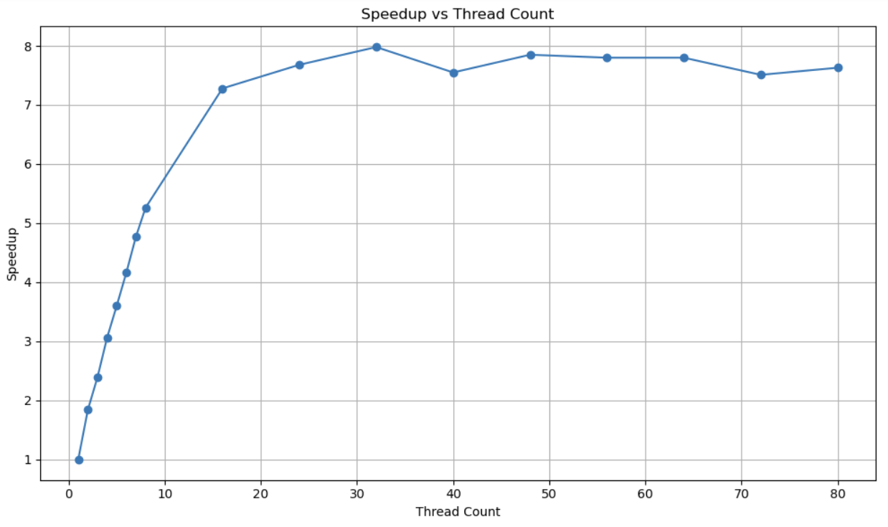

# CS-351 Project-2: Hash Computation Multithreading

## Overview

|Thread Count|Wall Clock Time|User Time|System Time|Speedup|
|:--:|--:|--:|--:|:--:|
|1|14.20|13.64| 0.44|1.00|
|2| 7.71|14.43| 0.49| 1.84|
|3| 5.95|16.30| 0.56| 2.39|
|4| 4.64|16.37| 0.73| 3.06|
|5| 3.94|16.83| 0.86| 3.60|
|6| 3.41|16.87| 1.00| 4.16|
|7| 2.98|16.73| 1.07| 4.77|
|8| 2.70|16.57| 1.30| 5.26|
|16| 1.95|18.25| 2.99| 7.28|
|24| 1.85|19.17| 6.92| 7.68|
|32| 1.78|18.45|15.69| 7.98|
|40| 1.88|17.89|20.82| 7.55|
|48| 1.81|17.51|34.93| 7.85|
|56| 1.82|17.37|38.62| 7.80|
|64| 1.82|17.08|45.54| 7.80|
|72| 1.89|17.29|46.17| 7.51|
|80| 1.86|17.07|43.74| 7.63|

**Question:** Notice that there is a maximum speed-up factor, but not necessarily using the most threads.
- Adding more cores won't guarantee a performance increase. Code that cannot be parallelized has a performance limit even with additional cores. Making more threads requires additional processing by the machine, which can diminish the benefits of adding cores. While additional cores may process more, they can also create a bottleneck.

**Question:** Do you think it’s possible to get “perfect scaling” — meaning that the (1-p) terms is zero?
- No, perfect scaling would require that 100% of the code is parallelizable, which is impossible because every program has parts that must run serially.

**Question:** For your own timings, compute your expected speed-up for 16 cores.

$$
\text{speedup} = \frac{1}{1 - 0.999235 + \frac{0.999235}{16}} = 15.82
$$

**Question:** In reviewing the graph of speed-ups to number of threads, what’s the slope of that line? Does that linear trend continue as we add more threads? What do you think causes the curve to “flatten out” when we use large thread counts?

$$
\text{slope} = \frac{\text{speedup}_7 - \text{speedup}_1}{7 - 1} = \frac{4.77 - 1.00}{6} = 0.63
$$

- From 7 to 16 it stops following the linear trend and aftre 16 it begins to flatten out. This is happening because of Amdahl's Law which prevents the program speedup based on the serial portion. The increased threads also causes more overhead.
