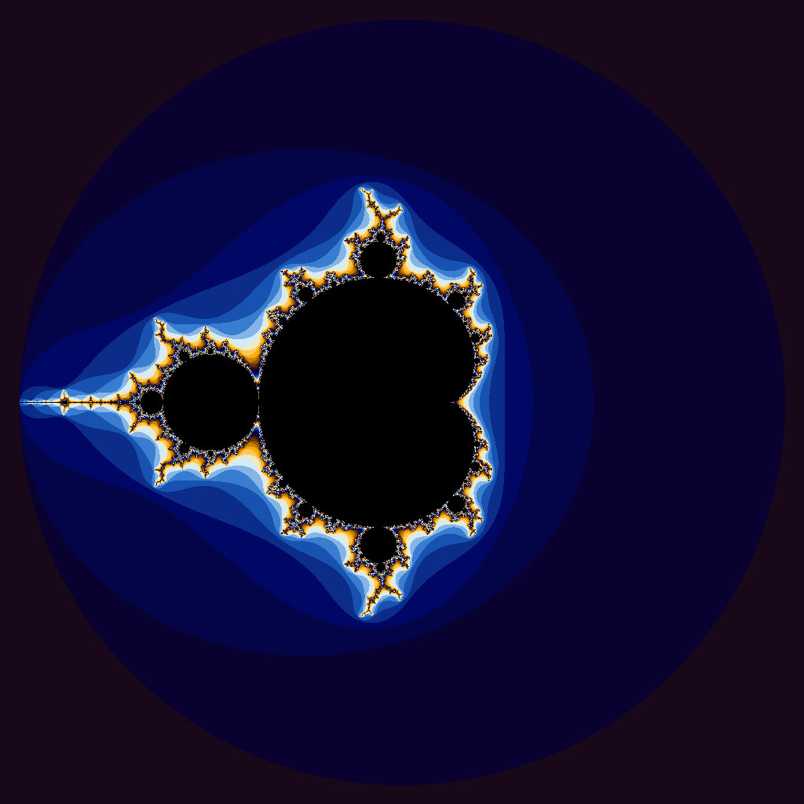

# CS-351 Project-4: Simple NVIDIA CUDA Applications
## Overview:
- iota.cu: Fills an array with sequential values in parallel using one thread per element.
- julia.cu: Generates a fractal image by mapping each pixel to a complex number and iterating to determine its color.

./runTrials.sh ./iota.gpu
|Vector Length|Wall Clock Time|User Time|System Time|
|:--:|--:|--:|--:|
|10| 0.29| 0.01| 0.27|
|100| 0.20| 0.01| 0.19|
|1000| 0.20| 0.01| 0.18|
|10000| 0.20| 0.00| 0.20|
|100000| 0.21| 0.01| 0.20|
|1000000| 0.21| 0.01| 0.20|
|5000000| 0.24| 0.02| 0.22|
|100000000| 0.82| 0.18| 0.64|
|500000000| 3.47| 0.82| 2.64|
|1000000000| 6.85| 1.64| 5.21|
|5000000000|39.80| 8.74|31.06|

./runTrials.sh ./iota.cpu
|Vector Length|Wall Clock Time|User Time|System Time|
|:--:|--:|--:|--:|
|10| 0.00| 0.00| 0.00|
|100| 0.00| 0.00| 0.00|
|1000| 0.00| 0.00| 0.00|
|10000| 0.00| 0.00| 0.00|
|100000| 0.00| 0.00| 0.00|
|1000000| 0.00| 0.00| 0.00|
|5000000| 0.02| 0.00| 0.02|
|100000000| 0.53| 0.08| 0.45|
|500000000| 2.88| 0.44| 2.43|
|1000000000| 5.80| 0.87| 4.93|
|5000000000|37.52| 6.57|30.94|

Question: Are the results what you expected? Speculate as to why it looks like CUDA isn’t a great solution for this problem.

No. The task is too lightweight for CUDA. The overhead that comes with CUDA makes it a poor use case for the task. No performance benefits are gained.

